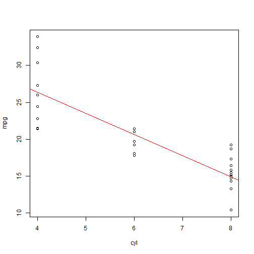

## Introduction:

This presentation is part of the Course Project for the Developing Data Products class. The peer assessed assignment has two parts. First, we need to create a Shiny application and deploy it on Rsrudio's servers. Second, we should use Slidify or Rstudio Presenter to prepare a reproducible pitch presentation about the application. This presentation addresses the second part of the course project.

The app developed for the first part of the assignment is available at:

https://santhoshidharmireddi.shinyapps.io/DDPCourseProject

Source code for ui.R and server.R files are available on the Github:

https://github.com/santhoshidharmireddy/Developing-Data-Products-Project/tree/master/CourseProjectPart1


--- .class #id 

## Design

The application uses the default "mtcars" dataset installed with R. It contains plot settings for interactive data analysis without much code modifications.

This app helps you to find the relationship between different variables and miles per gallon (MPG). This app also provides summary statistics for each relationship.


--- .class #id 

## mtcars Dataset

The data used in the app comes from the Motor Trend Car Road Tests (mtcars) dataset. The data was extracted from the 1974 Motor Trend US magazine, and comprise fuel consumption and 10 variables of automobile design and performance for 32 automobiles (1973-74 models). We can look at some characteristics of the data:


```r
head(mtcars)
```

```
##                    mpg cyl disp  hp drat    wt  qsec vs am gear carb
## Mazda RX4         21.0   6  160 110 3.90 2.620 16.46  0  1    4    4
## Mazda RX4 Wag     21.0   6  160 110 3.90 2.875 17.02  0  1    4    4
## Datsun 710        22.8   4  108  93 3.85 2.320 18.61  1  1    4    1
## Hornet 4 Drive    21.4   6  258 110 3.08 3.215 19.44  1  0    3    1
## Hornet Sportabout 18.7   8  360 175 3.15 3.440 17.02  0  0    3    2
## Valiant           18.1   6  225 105 2.76 3.460 20.22  1  0    3    1
```


--- .class #id

## Plot


```r
formula<- lm(mpg ~ cyl, data = mtcars)
p<- plot(as.integer(mtcars$cyl), mtcars$mpg, xlab = "cyl", ylab = "mpg")
abline(formula, col=2)
```



